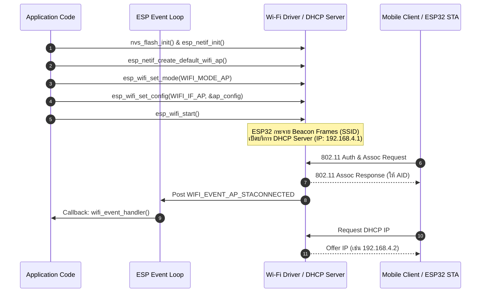
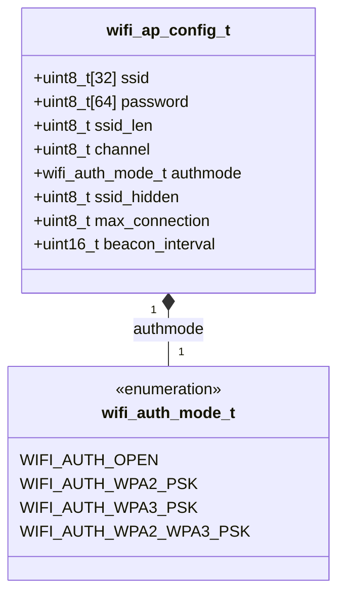
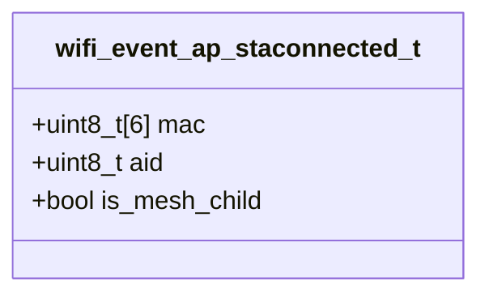

# สถาปัตยกรรม ESP32 Wi-Fi SoftAP Mode (Access Point Mode)

ในสัปดาห์ก่อนหน้า เราได้ศึกษา ESP32 ในโหมด **Station (`WIFI_MODE_STA`)** ซึ่งทำหน้าที่เป็นอุปกรณ์ลูกข่ายคอยร้องขอเชื่อมต่อกับ Access Point (AP) ภายนอก 

ในบทเรียนนี้ เราจะสลับบทบาทของ ESP32 ให้ทำหน้าที่เป็น **SoftAP (Software-enabled Access Point)** เพื่อทำหน้าที่เป็นโฮสต์กระจายสัญญาณ Wi-Fi ของตนเอง แจ้งเตือนบีคอน (Beacon Frames), ตกลงการเชื่อมต่อกับ Client อื่นๆ และทำหน้าที่เป็น **DHCP Server** แจ้งมอบหมายหมายเลข IP Address ให้แก่เครื่องที่เข้ามาเชื่อมต่อ

---

## 1. ลำดับขั้นตอนการทำงานของ ESP32 SoftAP (Sequence Diagram)

---

## 2. โครงสร้างข้อมูล `wifi_config_t` สำหรับโหมด AP (Class Diagram)

การกำหนดค่า AP จะใช้สมาชิก `.ap` ในยูเนียน `wifi_config_t` ซึ่งประกอบด้วยพารามิเตอร์สำคัญระดับวิทยุและเครือข่าย:

### สมาชิกสำคัญใน `wifi_ap_config_t`:
1. **`ssid`**: ชื่อเครือข่าย ไวไฟความยาวไม่เกิน 32 ไบต์
2. **`password`**: รหัสผ่าน WPA2 ความยาวอย่างน้อย 8 ตัวอักษร (หากเลือก `WIFI_AUTH_OPEN` จะไม่ต้องกำหนด)
3. **`channel`**: ช่องสัญญาณความถี่ 2.4GHz (1 ถึง 13)
4. **`max_connection`**: จำนวนอุปกรณ์สูงสุดที่อนุญาตให้ต่อพร้อมกัน (สำหรับ ESP32 รองรับสูงสุดได้ประมาณ 4 ถึง 10 เครื่องขึ้นอยู่กับ Memory)
5. **`authmode`**: โหมดความปลอดภัย แนะนำให้ใช้ `WIFI_AUTH_WPA2_PSK` หรือ `WIFI_AUTH_OPEN`

---

## 3. การจัดการ DHCP Server (`esp_netif_dhcps`)

เมื่อสร้างจุดเชื่อมต่อด้วย `esp_netif_create_default_wifi_ap()` ระบบ ESP-IDF จะเปิดใช้งาน **DHCP Server** บนอินเทอร์เฟซ `192.168.4.1` โดยอัตโนมัติ:

* **IP Address ของ ESP32 AP**: `192.168.4.1` (Gateway / Master Node)
* **Subnet Mask**: `255.255.255.0`
* **DHCP IP Lease Pool**: แจกจ่าย IP ตั้งแต่ `192.168.4.2` ถึง `192.168.4.11`

---

## 4. โครงสร้าง Event ดักจับ Client (`WIFI_EVENT_AP_STACONNECTED`)

เมื่อมี Client ภายนอกเชื่อมต่อเข้า AP ของ ESP32 ไดรเวอร์จะส่ง Event `WIFI_EVENT_AP_STACONNECTED` พร้อมแนบโครงสร้างข้อมูล `wifi_event_ap_staconnected_t`:

* **`mac`**: หมายเลข MAC Address ขนาด 6 ไบต์ของอุปกรณ์ที่เข้ามาต่อ (สามารถสกัดสตรีมเพื่อระบุตัวตนอุปกรณ์)
* **`aid`**: Association ID ที่ ESP32 มอบหมายให้ (เช่น AID = 1, 2, 3...)

---

## 5. สรุปความแตกต่างระหว่าง STA Mode กับ SoftAP Mode

| คุณสมบัติ | โหมด Client Station (`WIFI_STA`) | โหมด Access Point (`WIFI_AP`) |
| :--- | :--- | :--- |
| **บทบาท** | อุปกรณ์ลูกข่าย ขอต่อ Router | อุปกรณ์โฮสต์ กระจายสัญญาณให้คนอื่นต่อ |
| **DHCP Service** | เป็น DHCP Client (ขอรับ IP) | เป็น DHCP Server (แจก IP ให้ Client) |
| **การรับส่ง Event** | `WIFI_EVENT_STA_CONNECTED` | `WIFI_EVENT_AP_STACONNECTED` |
| **ไอพีเริ่มต้น** | รับจาก Router ข้างนอก | กำหนดตัวเองเป็น `192.168.4.1` |
| **ข้อจำกัดฮาร์ดแวร์** | ต่อได้ครั้งละ 1 AP | รับ Client ได้จำกัด (ปกติ 4-10 เครื่อง) |
